# 🌿 Eco Warrior - Carbon Footprint Tracker

A Flutter-based mobile application for tracking carbon footprint from home appliances, paired with a FastAPI backend for data management.

## 📱 Features

- **Dashboard** - View daily/weekly/monthly carbon footprint statistics
- **Appliance Management** - Add and manage home appliances with power ratings
- **Usage Logging** - Log appliance usage hours and calculate emissions
- **Reports & Analytics** - Visual charts showing consumption trends
- **Eco Tips** - Personalized recommendations to reduce carbon footprint
- **Achievements** - Gamification system with badges for eco-friendly habits
- **Dark/Light Mode** - Theme toggle support

## 🚀 Quick Start

### Option 1: Install APK (Easiest - Android)
1. Download the APK from `releases/app-release.apk`
2. Install on your Android device
3. Note: For full features, you need to run the backend locally

### Option 2: Run on Web (Chrome)

#### Step 1: Start the Backend
Open a terminal and run:
```bash
cd backend
pip install -r requirements.txt
python main.py
```
The backend will start on `http://127.0.0.1:8001`

#### Step 2: Run the Flutter App
Open a **new terminal** (keep backend running) and run:
```bash
flutter run -d chrome
```

The app will open in your browser at `http://localhost:xxxx`

### Option 3: Run on Android Emulator

#### Step 1: Start the Backend
```bash
cd backend
pip install -r requirements.txt
python main.py
```

#### Step 2: Run Flutter
```bash
flutter run -d emulator
```

---

## 🛠️ Tech Stack

### Frontend
- **Flutter** - Cross-platform UI framework
- **Provider** - State management
- **fl_chart** - Data visualization
- **shared_preferences** - Local storage
- **http** - API communication

### Backend
- **FastAPI** - Python web framework
- **SQLite** - Database
- **Pydantic** - Data validation

---

## ⚠️ Important Notes

### Backend Required
The app **requires the backend server to be running** for full functionality:
- User registration/login
- Appliance management
- Usage logging
- Reports & analytics

Without the backend, the app will show a "Connection error".

### Running on Different Devices

| Device | Backend IP | Backend Port |
|--------|-----------|-------------|
| Web (Chrome) | localhost | 8001 |
| Android Emulator | 10.0.2.2 | 8001 |
| Android Device | Your PC's local IP | 8001 |

For Android device, find your PC's IP with `ipconfig` (Windows) or `ifconfig` (Mac/Linux).

---

## 📁 Project Structure

```
├── lib/                    # Flutter frontend
│   ├── core/              # Theme, constants, utilities
│   ├── models/            # Data models
│   ├── providers/        # State management
│   ├── screens/          # App screens
│   ├── services/         # API services
│   └── widgets/          # Reusable widgets
├── backend/               # FastAPI backend
│   ├── routes/          # API endpoints
│   ├── schemas/         # Data schemas
│   └── services/       # Database services
├── releases/             # Prebuilt APKs
└── web/                 # Web build files
```

---

## 📊 API Endpoints

| Method | Endpoint | Description |
|--------|----------|-------------|
| GET | `/` | Health check |
| GET | `/health` | API health status |
| POST | `/calculate` | Calculate carbon footprint |
| POST | `/user/register` | Register new user |
| POST | `/user/login` | Login user |
| GET | `/user/{user_id}` | Get user data |
| GET | `/appliances/{user_id}` | Get user appliances |
| POST | `/appliances/{user_id}` | Add new appliance |
| GET | `/usage/{user_id}` | Get usage logs |
| POST | `/usage/{user_id}` | Create usage log |
| GET | `/analytics/{user_id}` | Get analytics data |

---

## 🔧 Troubleshooting

### Connection Error
- Make sure the backend is running: `python backend/main.py`
- Check firewall allows port 8001

### Port Already in Use
```bash
# Find and kill the process using port 8001
netstat -ano | findstr :8001
taskkill /PID <PID> /F
```

### Flutter Dependencies
```bash
flutter clean
flutter pub get
```

---

## 🌐 Screenshots

### DASHBOARD
| # | Feature | Screenshot |
|---|---------|------------|
| 1 | Dashboard Overview | 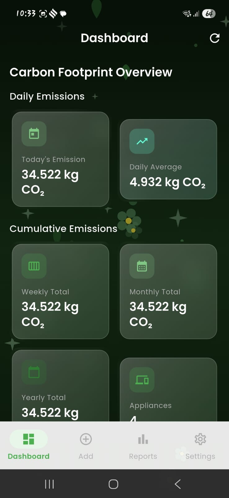 |
| 2 | Dashboard Stats | 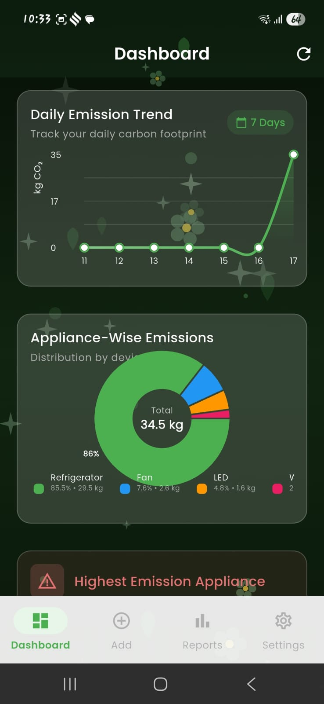 |
| 3 | Dashboard Charts | 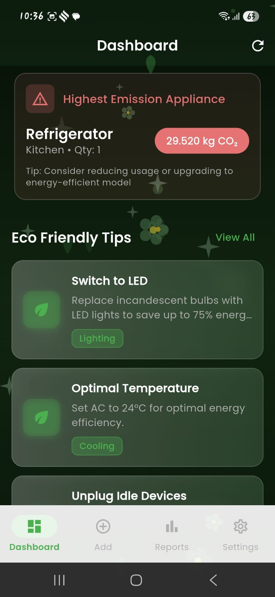 |
| 4 | Eco Tips | 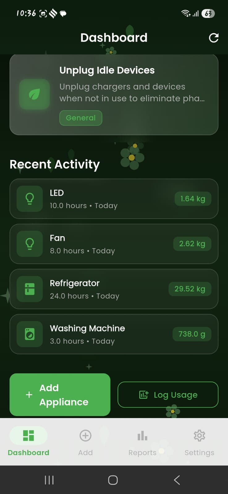 |

### ADD APPLIANCES
| # | Feature | Screenshot |
|---|---------|------------|
| 5 | Add Appliances | 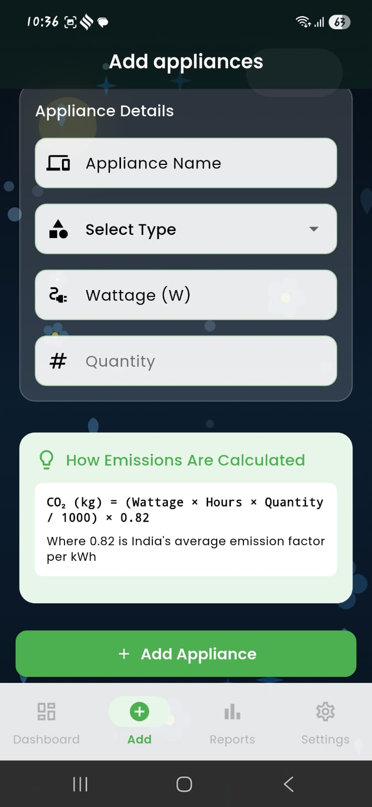 |
| 6 | Appliance List | 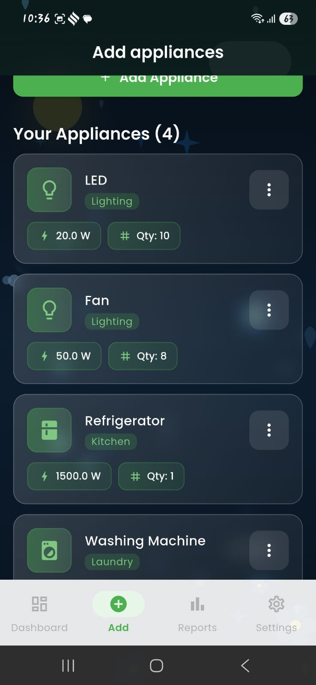 |

### REPORTS & ANALYTICS
| # | Feature | Screenshot |
|---|---------|------------|
| 7 | Reports Overview | 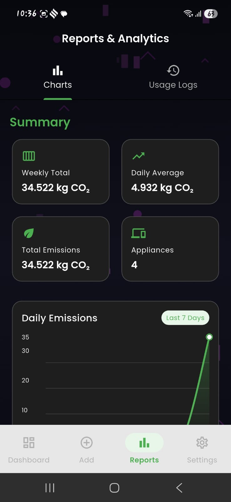 |
| 8 | Analytics | 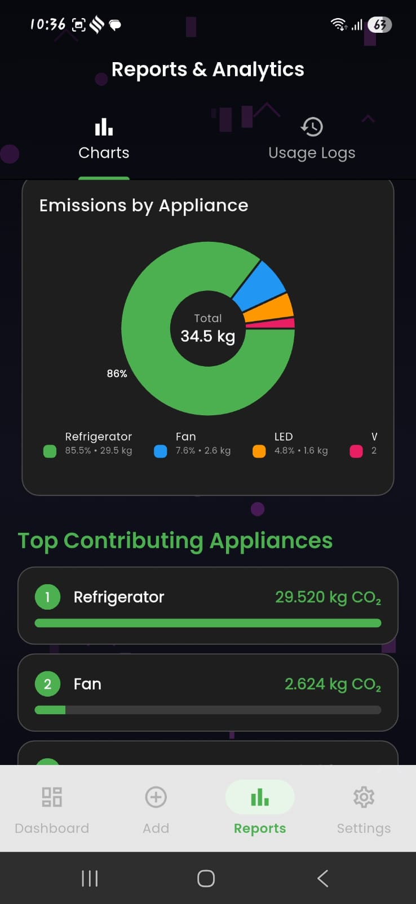 |
| 9 | Usage Logs | 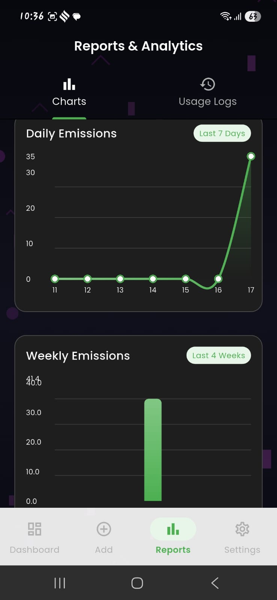 |
| 10 | Achievement Badges | 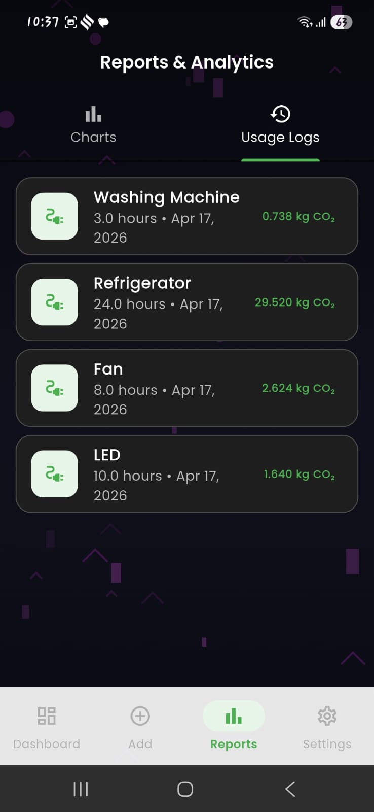 |

### SETTINGS
| # | Feature | Screenshot |
|---|---------|------------|
| 11 | ⚙️ Settings & Profile | 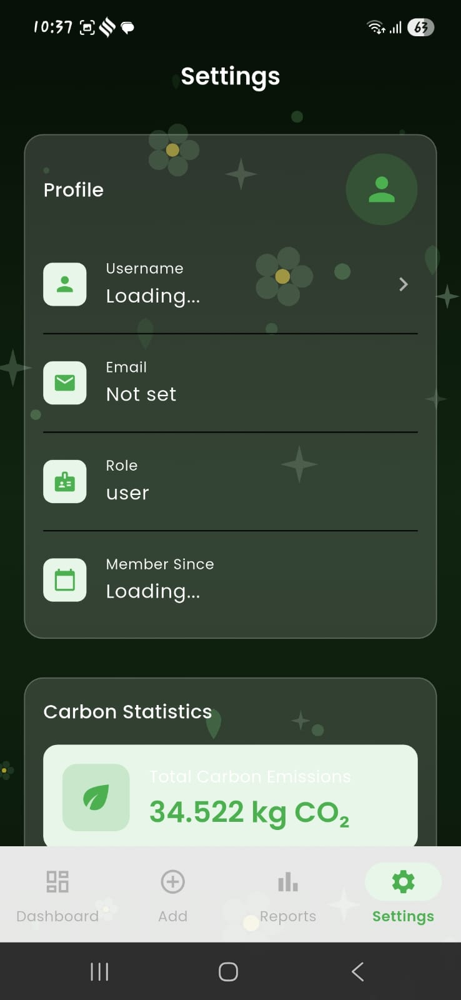 |
| 12 | 🌙 Dark Mode Dashboard | 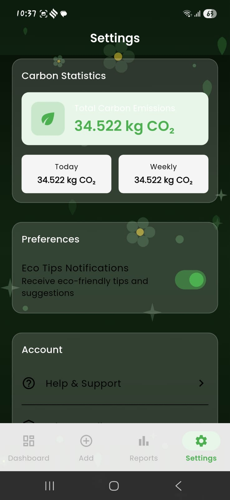 |
| 13 | 🔌 Check Server Connection | 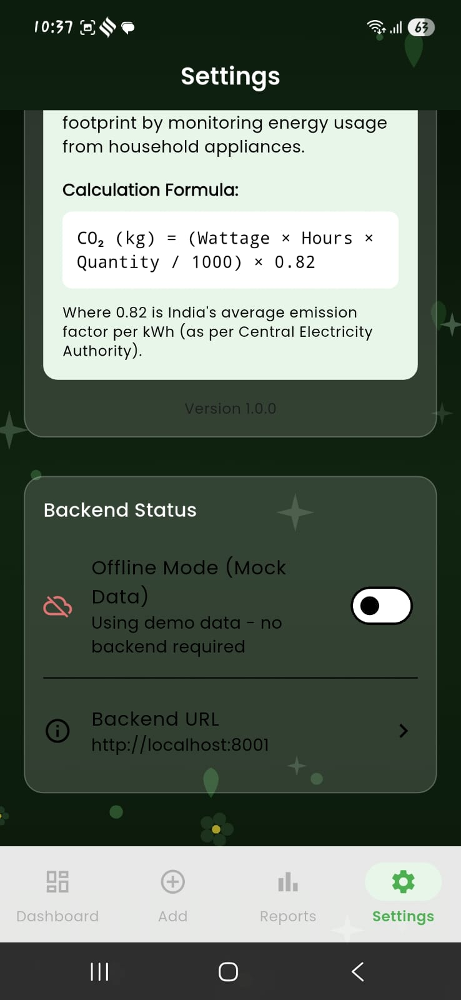 |
| 14 | 👋 User Data Log Out | 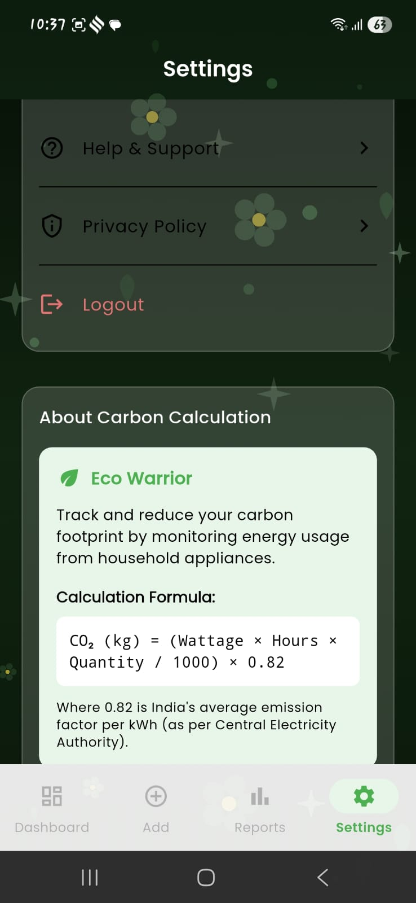 |

---

## 📝 License

MIT License

---

Made with ❤️ for a greener planet 🌏